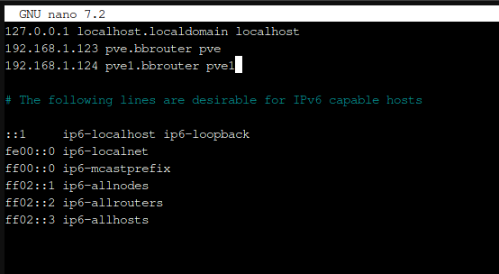
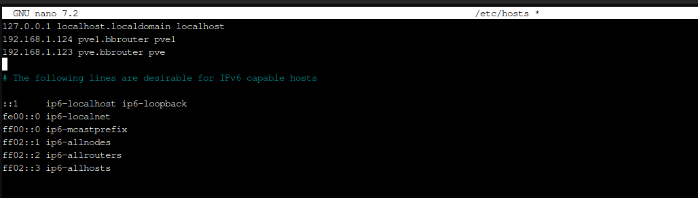

### Main Proxmox (node 1)
1. Installed proxmox.
2. Hostname: pve.bbrouter 

### Secondary Proxmox (node 2)
1. Installed proxmox
2. Hostname: pve1.bbrouter

### Making the Servers resolve eachother:
#### This is done on the old proxmox server(node 1):
     Its ip address is 192.168.1.123
     

So, now when i try to  `ping pve1`,  I am actually pinging the new proxmox machine (node 2) and I get a response.

#### This is done on the new proxmox (node 2):
     Its ip address is 192.168.1.124   

