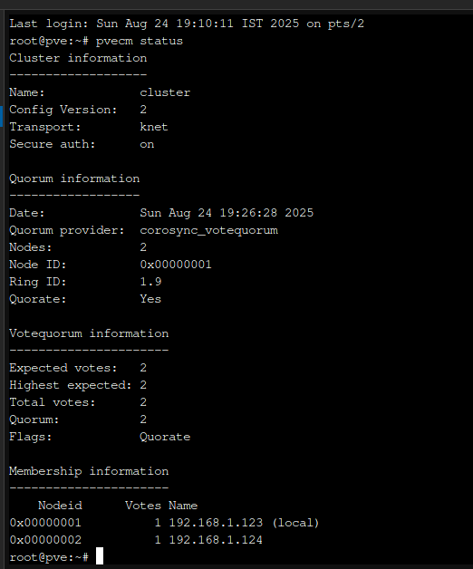
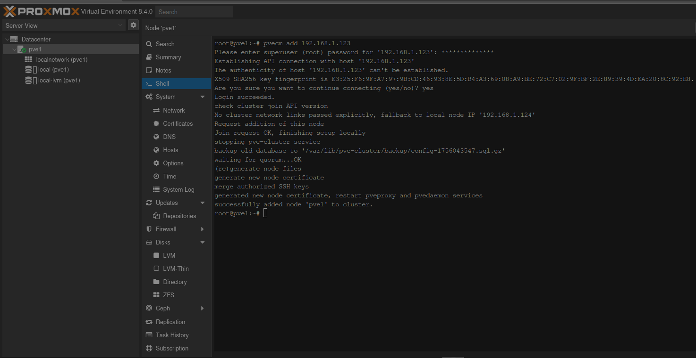
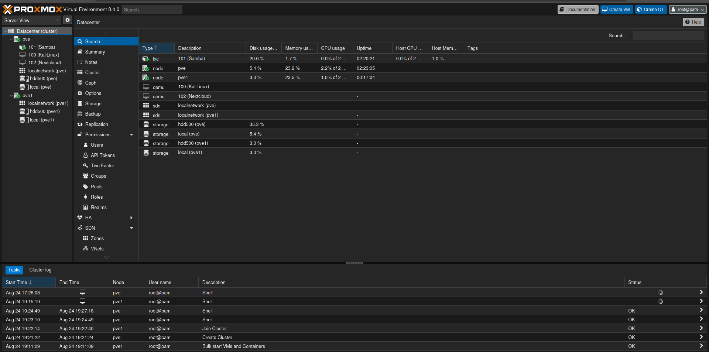

#### Creating cluster on pve

On **Node 1** (your current running server):
Run  `pvecm create cluster`
Check cluster status: `pvecm status`

#### Joining the Second Node
Do this on the new proxmox machine (Freshly installed proxmox)
`pvecm add 192.168.1.123`

### If the Clustering is successful we will see:

Where `pve` is the current running server and the `pve1` is the clustered server.

